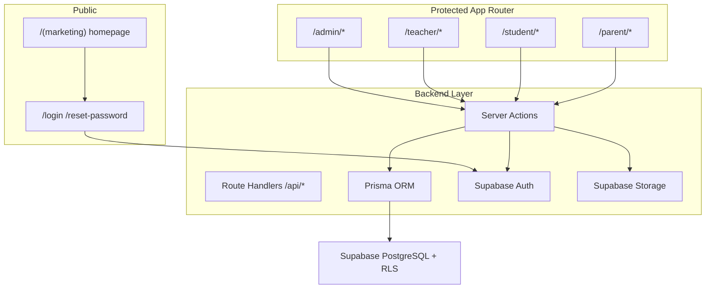
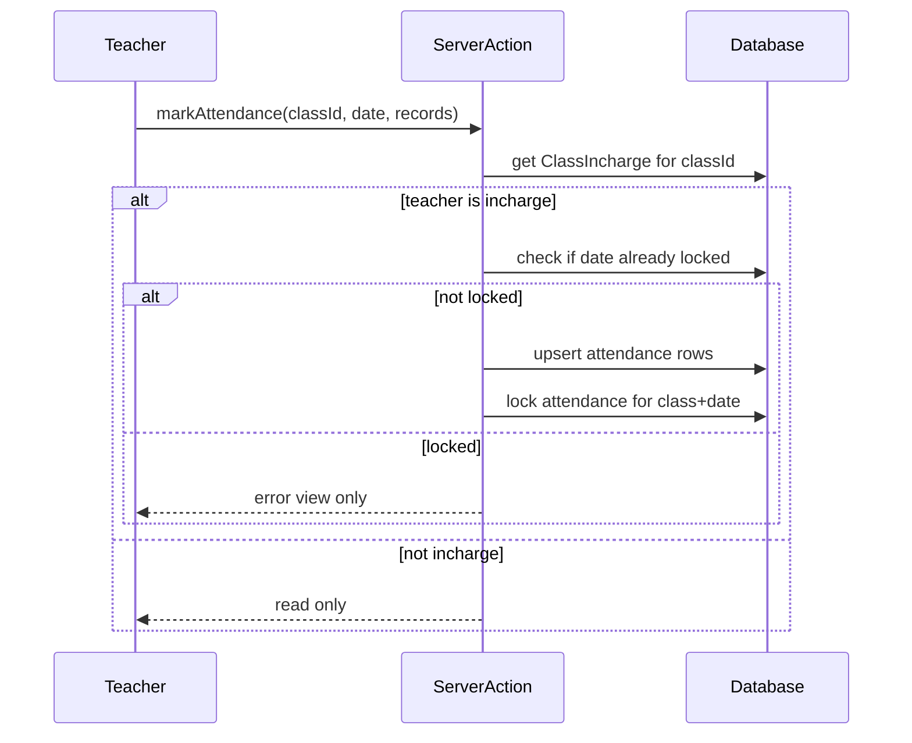

# Fusion College LMS — Full Upgrade Plan

## Recommended approach

**Single Next.js 15 monolith** (best fit for Vercel, one domain, shared design system, unified auth):

- Public marketing pages stay live at `/` (migrated from current [`src/App.jsx`](f:\Fusion College Website\src\App.jsx))
- LMS portals live under protected route groups: `/admin`, `/teacher`, `/student`, `/parent`
- Current Vite app becomes reference during migration, then retired after parity

**Auth model (confirmed):** Supabase Auth for credentials + Prisma `User` profile table for `role`, `status`, `profileImage`, and relations. Passwords are **not** stored in Prisma.



---

## Phase 0 — Foundation (Week 1)

### 0.1 Bootstrap Next.js in repo root (alongside Vite initially)

Create new structure without deleting Vite until marketing parity:

```
fusion-college/
├── app/
│   (marketing)/          # public site
│   (auth)/               # login, reset
│   (dashboard)/          # role dashboards
│   api/                  # webhooks, exports
├── components/
│   marketing/            # migrated hero, sections
│   ui/                   # shadcn
│   dashboard/            # shared LMS UI
├── lib/
│   prisma.ts
│   supabase/             # server + client helpers
│   auth/                 # RBAC guards
│   validations/          # Zod schemas
├── prisma/
│   schema.prisma
│   seed.ts
├── stores/               # Zustand
└── styles/
    globals.css           # migrated tokens from index.css
```

**Stack install:** Next.js 15, TypeScript, Tailwind, shadcn/ui, Framer Motion, Lucide, Zustand, React Hook Form, Zod, TanStack Table, Recharts, `@supabase/ssr`, Prisma.

### 0.2 Preserve design language

Port tokens from [`src/index.css`](f:\Fusion College Website\src\index.css) into Tailwind + CSS variables:

| Brand | Light | Usage |
|-------|-------|-------|
| Navy | `#3D4193` | primary, headings |
| Red | `#E8001D` | accents, ribbon |
| Cyan | `#00B4D8` | labels, links |
| Clay shadows | existing `--clay-shadow*` | cards, buttons |

- Extract reusable marketing components from monolithic `App.jsx`: `Hero`, `SectionShell`, `SectionHead`, `Navbar`, `Footer`, `StatsBar`, `FusionCanvas`
- Convert inline SVG icons → Lucide React
- Keep [`public/logo.png`](f:\Fusion College Website\public\logo.png) and 3D hero (React Three Fiber in a client component)

### 0.3 Middleware + route protection

[`middleware.ts`](middleware.ts) using Supabase session + role redirect:

- Unauthenticated → `/login`
- Wrong role → role home (`/admin`, `/teacher`, etc.)
- Marketing routes remain public

---

## Phase 1 — Database schema (Week 1–2)

### Prisma models (core)

```prisma
enum Role { ADMIN TEACHER STUDENT PARENT }
enum UserStatus { ACTIVE INACTIVE DELETED }
enum AttendanceStatus { PRESENT ABSENT LEAVE }
enum SubmissionStatus { PENDING SUBMITTED GRADED LATE }

model User {
  id            String   @id @default(uuid())
  authId        String   @unique          // Supabase auth.users.id
  name          String
  email         String   @unique
  role          Role
  profileImage  String?
  status        UserStatus @default(ACTIVE)
  createdAt     DateTime @default(now())
  teacher       Teacher?
  student       Student?
  parent        Parent?
}

model Teacher { id, userId, phone, qualification, subjects[], classAssignments[] }
model Student { id, userId, fatherName, rollNumber, classId, group, phone, parentLinks[] }
model Parent  { id, userId, phone, studentLinks[] }

model Class { id, name, group, academicYear, members[], incharge?, subjects[] }
model Subject { id, name, classSubjects[] }
model ClassSubject { classId, subjectId, teacherId }

model ClassIncharge {
  id, classId, teacherId, assignedByAdminId, assignedDate, status
}

model Post { id, classId, authorId, title, description, attachments[], createdAt }
model Material { id, classId, title, description, fileUrl, createdById }
model Assignment { id, classId, title, instructions, deadline, attachments[] }
model Submission { id, assignmentId, studentId, fileUrl, grade, comment, status }

model Lecture { id, classId, subjectId, date, number }
model Attendance {
  id, studentId, classId, subjectId, lectureId, teacherId,
  date, status, locked, createdAt
}

model TestSession { id, name, startDate, endDate, instructions, exams[] }
model Exam { id, sessionId, name, subjectId, classId, date, totalMarks, duration, teacherId }
model ExamResult { id, examId, studentId, marksObtained, percentage, grade }

model Notification { id, userId, type, title, body, read, metadata, createdAt }
```

### Supabase RLS (high level)

| Table | Admin | Teacher | Student | Parent |
|-------|-------|---------|---------|--------|
| User profiles | full | own + class members | own | own + linked children |
| Attendance | full + override | incharge write, others read | read own | read child |
| Assignments/Posts | full | own classes write | read + submit | read child |
| Exam results | full | assigned tests write | read own | read child |

Prisma runs server-side with service role for admin actions; client reads go through Supabase client + RLS where applicable.

### Storage buckets

- `materials/` — PDFs, notes
- `assignments/` — teacher uploads
- `submissions/` — student uploads
- `reports/` — generated PDFs (optional cache)

---

## Phase 2 — Authentication (Week 2)

**Pages:** `/login`, `/logout`, `/reset-password`

**Flow:**
1. Supabase Auth sign-in
2. Fetch Prisma `User` by `authId`
3. Check `status === ACTIVE`
4. Redirect by `role`

**Admin-only actions (Server Actions):**
- Create user in Supabase Auth + Prisma profile
- Generate temp password / send reset link
- Disable (`INACTIVE`) / soft-delete / restore
- Reset password via Supabase Admin API

**Files:**
- `app/(auth)/login/page.tsx`
- `lib/auth/session.ts`, `lib/auth/rbac.ts`
- `actions/auth.actions.ts`

---

## Phase 3 — Admin panel (Week 3–4)

**Layout:** sidebar + top bar (shadcn), clay card dashboard

### 3.1 Admin dashboard (`/admin`)
- KPI cards: students, teachers, classes, subjects
- Recharts: attendance overview, upcoming tests
- Recent activity feed (audit log from notifications/actions)

### 3.2 CRUD modules (TanStack Table + dialogs)

| Module | Route | Features |
|--------|-------|----------|
| Teachers | `/admin/teachers` | CRUD, assign classes/subjects, reset password, disable |
| Students | `/admin/students` | CRUD, bulk Excel import (`xlsx`), link parents |
| Parents | `/admin/parents` | CRUD, link 1..n students |
| Classes | `/admin/classes` | CRUD, move students, assign teachers |
| Subjects | `/admin/subjects` | CRUD, assign teacher + class |
| Class Incharges | `/admin/incharges` | assign/change/remove incharge |
| Test Sessions | `/admin/test-sessions` | schedule monthly tests |
| Exams | `/admin/exams` | create official exams per session |
| Attendance override | `/admin/attendance` | edit/unlock/delete |
| Reports | `/admin/reports` | all report types |

**Bulk import:** Excel template → Zod validate rows → transaction create students + optional parent link + auth invite.

---

## Phase 4 — Teacher panel (Week 5–6)

**Google Classroom-style layout** per class at `/teacher/classes/[classId]`

### Tabs (shared component `ClassWorkspaceTabs`)

1. **Stream** — posts with attachments (like Google Classroom feed)
2. **Classwork** — materials + assignments + submissions grading
3. **People** — students + teachers roster
4. **Attendance** — incharge-gated (see Phase 5)
5. **Marks** — exam result entry

**Teacher dashboard (`/teacher`):**
- My Classes grid
- Recent posts
- Upcoming tests
- Pending attendance (classes where user is incharge and today unlocked)

**Permissions:**
- Create posts/materials/assignments for assigned classes only
- Grade submissions
- Enter marks for assigned exams
- Cannot delete official admin exams

---

## Phase 5 — Attendance system (Week 6)

**Business rules (server-enforced):**



- One attendance lock per class per day (first incharge submission)
- Admin can unlock/edit/delete (audit logged)
- Status: `PRESENT | ABSENT | LEAVE`

---

## Phase 6 — Student LMS (Week 7)

**Dashboard (`/student`):** My Classes cards

**Class page tabs:** Stream, Classwork, People, Attendance, Results

**Features:**
- View/download materials
- Submit assignments (Supabase Storage upload)
- View marks + grades
- Attendance summary per subject (% + lecture breakdown)
- Read-only attendance (no edits)

---

## Phase 7 — Parent portal (Week 8)

**Dashboard (`/parent`):** linked children selector

Per child:
- Profile summary
- Daily + monthly attendance %
- Test performance + grades
- Assignments (submitted/pending)
- Notifications: absent alerts, new assignment/test, low attendance warning

**Notification triggers (server jobs / on-write hooks):**
- Attendance marked absent → notify parent
- New assignment/test → notify student + parent
- Attendance below threshold → warning

---

## Phase 8 — Test & exam system (Week 8–9)

- **Admin:** TestSession CRUD, Exam scheduling, calendar view (upcoming/completed/cancelled)
- **Teacher:** view assigned tests, enter marks, upload results
- **Student/Parent:** upcoming schedule + published results
- Auto-calculate percentage + grade (configurable grade scale in `lib/grades.ts`)

**Calendar component:** month view with exam badges, filters by class/subject/status

---

## Phase 9 — Reporting & export (Week 9–10)

**Report types:**

1. **Attendance Report** — filters: student/class/subject/month/range → print/PDF/Excel
2. **Test Performance** — by test or month
3. **Complete Student Report** — profile + attendance + all tests + averages
4. **Teacher Activity** — classes, attendance marked, tests, assignments

**Print system:**
- `@react-pdf/renderer` or `puppeteer` (API route) for PDF
- `xlsx` for Excel export
- Shared `ReportLayout` with college logo, name, date, signature area

**Routes:** `/admin/reports/*` + API `/api/reports/[type]/export`

---

## Phase 10 — Security hardening (ongoing)

- Zod validation on every Server Action + API route
- RBAC helper: `requireRole(['ADMIN'])`, `requireClassAccess(classId)`
- Supabase RLS policies per table
- Storage policies: users upload only to own submission paths; teachers to class paths
- Rate limiting on auth routes (Vercel middleware or Upstash)
- Audit log table for admin overrides

---

## Phase 11 — Deployment & handoff

### Environment variables (`.env.local`)

```
NEXT_PUBLIC_SUPABASE_URL=
NEXT_PUBLIC_SUPABASE_ANON_KEY=
SUPABASE_SERVICE_ROLE_KEY=
DATABASE_URL=             # Supabase Postgres connection string
DIRECT_URL=               # Prisma migrations
NEXT_PUBLIC_APP_URL=
```

### Setup steps (deliverable docs)

1. Create Supabase project → enable Auth (email/password)
2. Run `prisma migrate dev` + `prisma db seed` (admin user, sample classes)
3. Configure Storage buckets + RLS policies
4. Deploy to Vercel → connect env vars → set Supabase redirect URLs
5. Point `lms.fusioncollege.edu.pk` to Vercel (optional subdomain routing)

### Cutover from Vite

1. Marketing parity verified on Next.js `/`
2. LMS routes live on same domain
3. Remove Vite `src/` after UAT sign-off

---

## Files from current project to migrate (not break)

| Current | Next.js destination |
|---------|---------------------|
| [`src/App.jsx`](f:\Fusion College Website\src\App.jsx) sections | `components/marketing/*` + `app/(marketing)/page.tsx` |
| [`src/index.css`](f:\Fusion College Website\src\index.css) tokens | `styles/globals.css` + `tailwind.config.ts` |
| [`src/App.jsx` FusionCanvas](f:\Fusion College Website\src\App.jsx) | `components/marketing/FusionCanvas.tsx` (client) |
| [`public/logo.png`](f:\Fusion College Website\public\logo.png) | `public/logo.png` (unchanged) |

**Do not port:** monolithic state, client-only contact form alert → replace with Server Action + email/DB enquiry (optional Phase 11).

---

## Module implementation order (summary)

1. Next.js + Tailwind + shadcn + design tokens
2. Marketing homepage parity (no regression)
3. Prisma schema + Supabase + seed admin
4. Auth + RBAC middleware
5. Admin: users, classes, subjects, incharges
6. Teacher class workspace (stream → classwork → people)
7. Attendance (incharge lock logic)
8. Student portal
9. Parent portal + notifications
10. Test sessions + exams + calendar
11. Reports (PDF/Excel/print)
12. Vercel deploy + documentation

---

## Risk notes

- **Scope:** Full spec is ~10–12 weeks for one developer; ship MVP (auth + admin + teacher stream/classwork + student view + basic attendance) first, then reports/calendar/bulk import.
- **3D hero in Next.js:** requires `'use client'` + dynamic import (`ssr: false`) for Three.js bundle size.
- **Excel import:** needs clear column template documented for admin.
- **Single college tenant:** schema assumes one institution (Fusion College Narowal); no multi-tenant org model needed now.
